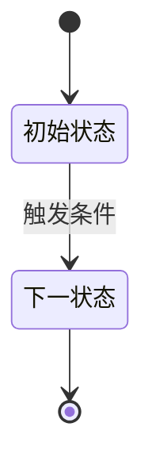
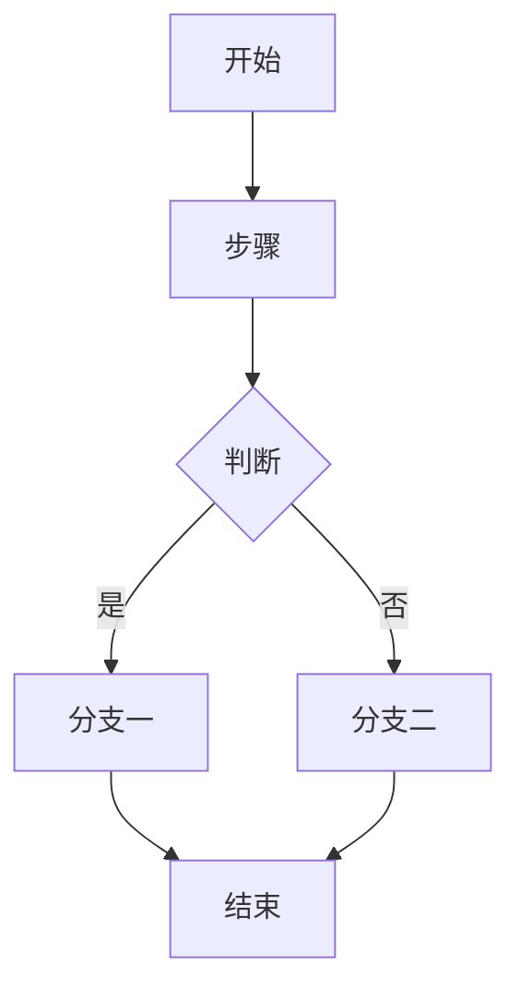

# <标题>流程图

## 状态的流转

| 状态 | 含义 | 进入条件 | 下一状态 / 退出条件 |
| --- | --- | --- | --- |
| … | … | … | … |

```mermaid
stateDiagram-v2
    [*] --> 初始状态
    初始状态 --> 下一状态: 触发条件
    下一状态 --> [*]
```

## 函数内运行流程图

```mermaid
flowchart TD
    A[开始] --> B[步骤]
    B --> C{判断}
    C -- 是 --> D[分支一]
    C -- 否 --> E[分支二]
    D --> F[结束]
    E --> F
```
